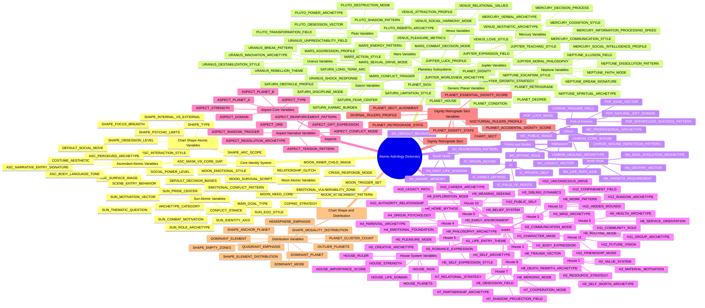

```mermaid
mindmap
  root((Atomic Astrology Dictionary))
    Core Identity System
      Sun Atomic Variables
        SUN_IDENTITY_AXIS
        SUN_MOTIVATION_VECTOR
        SUN_EGO_STYLE
        SUN_THEMATIC_QUESTION
        SUN_PRIDE_CENTER
        SUN_ROLE_ARCHETYPE
        MAIN_GOAL_TYPE
        ARCHETYPE_CATEGORY
        CONFLICT_STANCE
        DEFAULT_DECISION_BIASES
        SUN_COMBAT_MOTIVATION
      Moon Atomic Variables
        MOON_NEED_CORE
        MOON_EMOTIONAL_STYLE
        MOON_TRIGGER_SET
        MOON_ATTACHMENT_PATTERN
        MOON_SURVIVAL_SCRIPT
        MOON_INNER_CHILD_IMAGE
        CRISIS_RESPONSE_MODE
        EMOTIONAL_CONFLICT_PATTERN
        RELATIONSHIP_GLITCH
        COPING_STRATEGY
        EMOTIONAL_VULNERABILITY_ZONE
      Ascendant Atomic Variables
        ASC_SURFACE_IMAGE
        ASC_INTERACTION_STYLE
        ASC_BODY_LANGUAGE_TONE
        ASC_NARRATIVE_ENTRY_SIGNATURE
        ASC_PERCEIVED_ARCHETYPE
        ASC_MASK_VS_CORE_GAP
        COSTUME_AESTHETIC
        SOCIAL_POWER_LEVEL
        DEFAULT_SOCIAL_MOVE
        SCENE_ENTRY_BEHAVIOR
      Chart Shape Atomic Variables
        SHAPE_FOCUS_BREADTH
        SHAPE_INTERNAL_VS_EXTERNAL
        SHAPE_OBSESSION_LEVEL
        SHAPE_PSYCHIC_LIMITS
        SHAPE_ARC_SCOPE
        SHAPE_TYPE

    Planetary Subsystems
      Generic Planet Variables
        PLANET_SIGN
        PLANET_DEGREE
        PLANET_HOUSE
        PLANET_RETROGRADE
        PLANET_DIGNITY
        PLANET_CONDITION
      Mercury Variables
        MERCURY_COGNITION_STYLE
        MERCURY_COMMUNICATION_STYLE
        MERCURY_DECISION_PROCESS
        MERCURY_SOCIAL_INTELLIGENCE_PROFILE
        MERCURY_INFORMATION_PROCESSING_SPEED
        MERCURY_VERBAL_ARCHETYPE
      Venus Variables
        VENUS_LOVE_STYLE
        VENUS_ATTRACTION_PROFILE
        VENUS_PLEASURE_METRICS
        VENUS_RELATIONAL_VALUES
        VENUS_SOCIAL_HARMONY_MODE
        VENUS_AESTHETIC_ARCHETYPE
      Mars Variables
        MARS_ACTION_STYLE
        MARS_AGGRESSION_PROFILE
        MARS_SEXUAL_DRIVE_MODE
        MARS_COMBAT_DECISION_MODE
        MARS_ENERGY_PATTERN
        MARS_CONFLICT_TRIGGER
      Jupiter Variables
        JUPITER_GROWTH_STRATEGY
        JUPITER_MORAL_PHILOSOPHY
        JUPITER_LUCK_PROFILE
        JUPITER_EXPANSION_FIELD
        JUPITER_WORLDVIEW_ARCHETYPE
        JUPITER_TEACHING_STYLE
      Saturn Variables
        SATURN_FEAR_CENTER
        SATURN_DISCIPLINE_MODE
        SATURN_KARMIC_BURDEN
        SATURN_OBSTACLE_PROFILE
        SATURN_LONG_TERM_ARC
        SATURN_LIMITATION_STYLE
      Uranus Variables
        URANUS_BREAK_PATTERN
        URANUS_SHOCK_RESPONSE
        URANUS_INNOVATION_ARCHETYPE
        URANUS_REBELLION_THEME
        URANUS_UNPREDICTABILITY_FIELD
        URANUS_DESTABILIZATION_STYLE
      Neptune Variables
        NEPTUNE_DISSOLUTION_PATTERN
        NEPTUNE_ILLUSION_FIELD
        NEPTUNE_SPIRITUAL_ARCHETYPE
        NEPTUNE_ESCAPISM_STYLE
        NEPTUNE_DREAM_SIGNATURE
        NEPTUNE_FAITH_MODE
      Pluto Variables
        PLUTO_POWER_ARCHETYPE
        PLUTO_OBSESSION_VECTOR
        PLUTO_TRANSFORMATION_FIELD
        PLUTO_DESTRUCTION_MODE
        PLUTO_SHADOW_PATTERN
        PLUTO_REBIRTH_ARCHETYPE

    Points and Nodes
      North Node
        NN_LIFE_PATH_AXIS
        NN_DESTINY_VECTOR
        NN_GROWTH_REQUIREMENT
        NN_SOUL_EVOLUTION_ARCHETYPE
      South Node
        SN_KARMIC_MEMORY
        SN_DEFAULT_BEHAVIOR
        SN_PAST_LIFE_SHADOW
        SN_REGRESSION_PATTERN
      Midheaven
        MC_PUBLIC_IMAGE
        MC_PROFESSIONAL_ARCHETYPE
        MC_MYTHIC_ROLE
        MC_LEGACY_VECTOR
      IC
        IC_ORIGIN_WOUND
        IC_FIELD_OF_ROOTS
        IC_PRIVATE_SELF
        IC_FAMILY_MYTHOS
      Chiron
        CHIRON_CORE_WOUND
        CHIRON_HEALING_ARCHETYPE
        CHIRON_TRIGGER_FIELD
        CHIRON_WOUND_REPETITION_PATTERN
      Part of Fortune
        POF_LUCK_MODE
        POF_EASE_VECTOR
        POF_NATURAL_GIFT_DOMAIN
        POF_EFFORTLESS_SUCCESS_PATTERN

    Houses
      House System Variables
        HOUSE_SIGN
        HOUSE_RULER
        HOUSE_PLANETS
        HOUSE_LIFE_DOMAIN
        HOUSE_STRENGTH
        HOUSE_IMPORTANCE_SCORE
      House 1
        H1_SELF_ARCHETYPE
        H1_BODY_EXPRESSION
        H1_LIFE_ENTRY_THEME
        H1_CHARACTER_MASK
      House 2
        H2_VALUE_SYSTEM
        H2_RESOURCE_STRATEGY
        H2_SELF_WORTH_ARCHETYPE
        H2_MATERIAL_MOTIVATION
      House 3
        H3_MIND_ARCHETYPE
        H3_COMMUNICATION_MODE
        H3_SIBLING_DYNAMICS
        H3_EARLY_ENVIRONMENT
      House 4
        H4_HOME_MYTHOS
        H4_ORIGIN_PSYCHOLOGY
        H4_PARENTAL_ARCHETYPE
        H4_EMOTIONAL_FOUNDATION
      House 5
        H5_CREATIVE_ARCHETYPE
        H5_ROMANCE_EXPRESSION
        H5_PLEASURE_MODE
        H5_SELF_EXPRESSION_STYLE
      House 6
        H6_WORK_PATTERN
        H6_HEALTH_ARCHETYPE
        H6_ROUTINE_MODE
        H6_SERVICE_ORIENTATION
      House 7
        H7_PARTNERSHIP_ARCHETYPE
        H7_RELATIONAL_STRATEGY
        H7_SHADOW_PROJECTION_FIELD
        H7_COOPERATION_MODE
      House 8
        H8_TRAUMA_VECTOR
        H8_MERGING_MODE
        H8_OBSESSION_FIELD
        H8_DEATH_REBIRTH_ARCHETYPE
      House 9
        H9_BELIEF_SYSTEM
        H9_EXPLORATION_MODE
        H9_PHILOSOPHY_ARCHETYPE
        H9_MEANING_SEEKING
      House 10
        H10_CAREER_ARCHETYPE
        H10_PUBLIC_SELF
        H10_AUTHORITY_RELATIONSHIP
        H10_LEGACY_PATH
      House 11
        H11_GROUP_ARCHETYPE
        H11_FRIENDSHIP_MODE
        H11_COMMUNITY_ROLE
        H11_FUTURE_VISION
      House 12
        H12_SHADOW_ARCHETYPE
        H12_CONFINEMENT_FIELD
        H12_HIDDEN_WOUNDS
        H12_UNCONSCIOUS_DRIVE

    Aspects
      Aspect Core Variables
        ASPECT_PLANET_A
        ASPECT_PLANET_B
        ASPECT_TYPE
        ASPECT_ORB
        ASPECT_STRENGTH
        ASPECT_DOMAIN
      Aspect Narrative Variables
        ASPECT_TENSION_PATTERN
        ASPECT_REINFORCEMENT_PATTERN
        ASPECT_SHADOW_TRIGGER
        ASPECT_GIFT_EXPRESSION
        ASPECT_CONFLICT_MODE
        ASPECT_RESOLUTION_ARCHETYPE

    Dignity Retrograde Sect
      Dignity Retrograde Sect Variables
        PLANET_DIGNITY_STATE
        PLANET_ESSENTIAL_DIGNITY_SCORE
        PLANET_ACCIDENTAL_DIGNITY_SCORE
        PLANET_RETROGRADE_STATE
        PLANET_SECT_ALIGNMENT
        CHART_SECT
        DIURNAL_RULERS_PROFILE
        NOCTURNAL_RULERS_PROFILE

    Chart Shape and Distribution
      Distribution Variables
        SHAPE_ANCHOR_PLANET
        SHAPE_EMPTY_ZONES
        SHAPE_ELEMENT_DISTRIBUTION
        SHAPE_MODALITY_DISTRIBUTION
        HEMISPHERE_EMPHASIS
        QUADRANT_EMPHASIS
        PLANET_CLUSTER_COUNT
        OUTLIER_PLANETS
        DOMINANT_PLANET
        DOMINANT_ELEMENT
        DOMINANT_MODE

```
